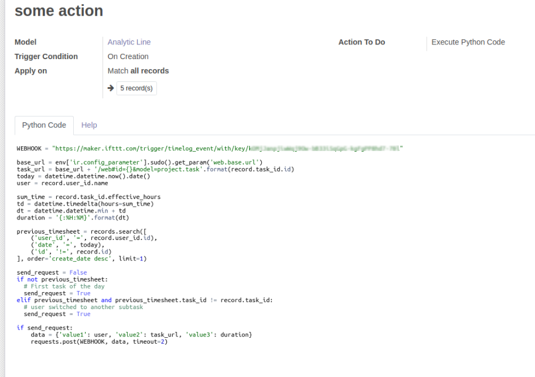
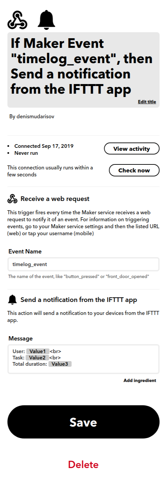

=================
 Project timelog
=================

Installation
============

* `Install <https://odoo-development.readthedocs.io/en/latest/odoo/usage/install-module.html>`__ this module in a usual way
* To use the module, you need to be sure that your odoo instance support longpolling, i.e. Instant Messaging works. Read more about how to use the `longpolling  <https://odoo-development.readthedocs.io/en/latest/admin/longpolling.html>`_
* You need to install a patch to use the new group (the beginning of the week is Sunday). The use of the patch is optional and needed only to use Sunday grouping (otherwise only Monday works). More `here. <https://github.com/odoo/odoo/pull/25086>`__ To apply the patch execute::

    cd /path/to/odoo/source
    patch -p1 < /path/to/0001-IMP-support-grouping-by-weeks-starting-with-Sunday.patch

Usage
=====

Timer launching

* Go to the menu ``Project >> Task``.
* Create a new subtask by clicking on ``Edit >> Add an item``.
* Click on green button ``play`` to switch on timer for this subtask.
* Click on red button ``pause`` to stop the timer.

How to see results

* Go to the menu ``Project >> Timelog >> My timelog``.
* Press to any timer’s datum (log is result of timer’s work).
* Logs of all users appear in secton ``Timelog`` (only for managers).

The timer work

* Click on the first timer to start it. Click again to stop it.
* Click on the second timer to open the page with the current task.
* Click on the third timer to open Logs page for current day.
* Click on the fourth timer to open Logs page for current week.

Forced completion of the task

* Click on ``Edit`` in current task and put to ``stopline`` date and time (if the timer was launched, it stops after achieving this time).

Webhooks
========

This section is about how you can implement integration with third-party services using the module `Outgoing Webhooks <https://apps.odoo.com/apps/modules/13.0/base_automation_webhook/>`__ (need to install additionally), for example, send notifications about user actions to telegram group through `IFTTT <https://ifttt.com>`__.

Consider the following example. Let's say we need to send a webhook when one of these following events occurs:
    * The user turned on the timer for the first time of the day.
    * The user switched to another task

You'll need:
    * `Odoo <https://www.odoo.com/>`__ with admin access to setup `Outgoing Webhooks <https://apps.odoo.com/apps/modules/13.0/base_automation_webhook/>`__.
    * `IFTTT <https://ifttt.com/>`__ account to setup `Webhooks <https://ifttt.com/maker_webhooks>`__.

Prepare IFTTT Webhook URL
    * Open Webhook page at `IFTTT <https://ifttt.com/maker_webhooks>`__
    * Click Documentation
    * Choose some event name, e.g. ``timelog_event``
    * Copy the url. It has following format: `https://maker.ifttt.com/trigger/EVENT_NAME/with/key/SOME-KEY`

Register Webhook:
    * Open Odoo
    * Install `Outgoing Webhooks <https://apps.odoo.com/apps/modules/13.0/base_automation_webhook/>`__ module
    * Create an Automated Action with the following values (see `Module Documentation <https://apps.odoo.com/apps/modules/13.0/base_automation_webhook/>`__ for details):
        * **Model**: Analytic Line (``account.analytic.line``).
        * **Trigger condition**: *On creation*.
        * **Action To Do**: *Execute Python Code*.
        * **Python Code**:

        .. code-block:: python

            WEBHOOK = "https://maker.ifttt.com/trigger/EVENT-NAME/with/key/SOME-KEY"

            base_url = env['ir.config_parameter'].sudo().get_param('web.base.url')
            task_url = base_url + '/web#id={}&model=project.task'.format(record.task_id.id)
            today = datetime.datetime.now().date()
            user = record.user_id.name

            sum_time = record.task_id.effective_hours
            td = datetime.timedelta(hours=sum_time)
            dt = datetime.datetime.min + td
            duration = '{:%H:%M}'.format(dt)

            previous_timesheet = records.search([
                ('user_id', '=', record.user_id.id),
                ('date', '=', today),
                ('id', '!=', record.id)
            ], order='create_date desc', limit=1)

            send_request = False
            if not previous_timesheet:
              # First task of the day
              send_request = True
            elif previous_timesheet and previous_timesheet.task_id != record.task_id:
              # user switched to another subtask
              send_request = True

            if send_request:
                data = {'value1': user, 'value2': task_url, 'value3': duration}
                requests.post(WEBHOOK, data, timeout=2)

    It should look like this:

Prepare IFTTT applet:
    * Open url: https://ifttt.com/create
    * **This**: search and select *Webhooks*

      * Choose *Receive a web request*
      * Set **Event Name** (in our example, ``timelog_event``)

    * **That**: search and select *Notifications*

      * Choose *Send a notification from the IFTTT app*

        * **User**: ``{{Value1}} ``
        * **Task**: ``{{Value2}} ``
        * **Total duration**: ``{{Value3}}``

Try it out:
    * Now to check that everything is working go to ``Project >> Task >> Timesheets``
    * Click the ``Edit`` button and add some line
    * Save and you'll receive a notification from IFTTT

Uninstallation
==============
* Open the``Project timelog`` module by going to Apps and click on the ``Uninstall`` button.
