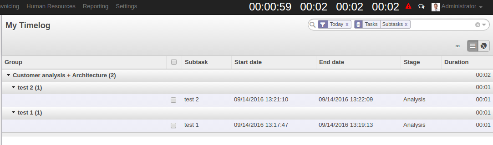
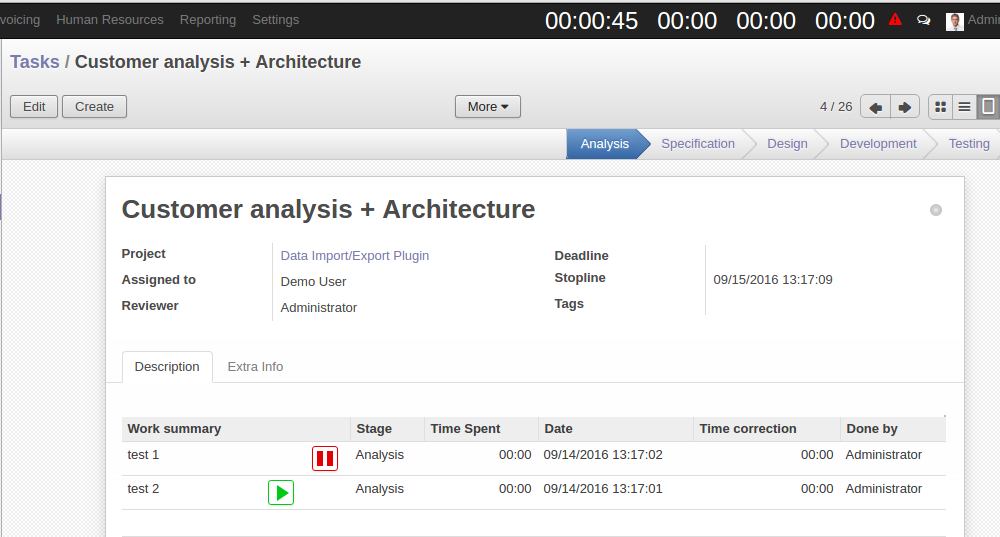
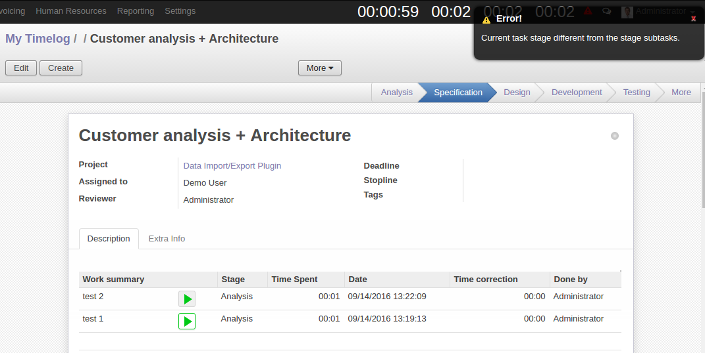

=================
 Project timelog
=================

Installation
============

To use the module, you need to be sure that your odoo instance support longpolling, i.e. Instant Messaging works.
Read more about how to use the `longpolling  <https://odoo-development.readthedocs.io/en/latest/admin/longpolling.html>`_

Usage
=====

* Очистить данные браузера
* Установите модуль ``project_timelog``.
* Откройте меню ``setting``
* В разделе Configuration откройте ``timelog``
* Выберете необходимые параметры конфигурации и нажмите на ``apply``

Параметры конфигурации:
=======================
* ``Install warning time`` – установка времени предупреждения, за сколько минут до остановки таймера необходимо предупреждать пользователя звуковым сигналом.
* ``Install completion time`` – лимит по работе таймера для подзадачи, по достижению которой таймер останавливается.
* ``Install normal time`` – установка времени предупреждения о количестве отработанных часов за текущий день (норма)
* ``Install good time`` -  установка времени предупреждения о количестве общих отработанных часов за текущий день учитывая сверхнорму.
* ``Install normal time`` - установка времени предупреждения о количестве отработанных часов за текущую неделю (норма)
* ``Install good time`` - установка времени предупреждения о количестве общих отработанных часов за текущую неделю учитывая сверхнорму.

.. image:: 1.png

Использование.
==============

После установки модуля, в правом верхнем углу появиться надпись ``time``, который означает что необходимо установить параметры таймера. После установки необходимых параметров в том же углу появиться таймер формата ``00:00:00 00:00 00:00 00:00``.
Таймер позволяет зафиксировать время работы пользователя над подзадачей в меню ``Project->Task``, следить за объемом выполняемой работы в течении суток и недели, так же следить за тем, сколько времени было потрачено на работу в текущей задачи.
Результат работы таймера записывается в меню ``Project -> Timelog`` в разделе ``My timelog``. Данный раздел показывает только логи текущего пользователя, в логах содержиться информация о том, для какой подзадачи запись, когда был запущен и остановлен таймер, сколько времени работал и в каком состоянии находилась карточка при записи лога. Менеджеру доступен раздел ``Timelog`` в которой видны все логи всех пользователей.

При выполнении работы необходимо создать новую подзадачу на странице карточки и запустить таймер. Для запуска таймера необходимо нажать на кнопку ``play``, для того чтобы остановить – ``stop``, после остановки таймера записывается общее время работы над подзадачей в ``Time Spent``.

Если подзадача была создана в одном состоянии карточки, то таймер для этой подзадачи не может быть запущен в другом состоянии карточки.

Таймер автоматически останавливается, если состояние в чате у пользователя offline, так же останавливается при отсутствии интернет соединения у пользователя. Если таймер остановился, то издается звуковой сигнал.
В случае если присутствуют подзадачи с логами не текущего дня, то данная подзадача становиться недоступной.

Описание таймера.
=================

* Первый таймер -  время по текущей подзадаче.  При приближении к отметке 2 часа (настраивается в Configuration) меняет цвет на оранжевый и издает короткий сигнал. При превышении отметки 2 часа (настраивается в Configuration) таймер останавливается и цвет меняется на красный, мигает, и издает длинный сигнал. При наведении показывает текущую подзадачу. При клике на таймер работает как пауза.
* Второй таймер - общее время по текущей задачи (суммируется только данные текущего пользователя). При превышении ``initially planned hours`` (учитываются все логи по задачи) меняет цвет на желтый. При превышении initially planned hours на 100% (настраивается) меняет цвет на красный.  При наведении показывает  initially planned hours, количество часов сделанных другими пользователями. При клике на таймер открывает карточку текущей задачи.
* Третий таймер - общее время за текущий день. При достижении 5 часов (настраивается в Configuration) меняет цвет на желтый. При достижении 6 часов (настраивается в Configuration) меняет цвет на зеленый. При клике на таймер открывает страницу с логами текущего дня.
* Четвёртый таймер - общее время за текущую неделю.  При достижении 30 часов (настраивается в Configuration) меняет цвет на зеленый и издает красивую мелодию. При достижении 40 часов (настраивается в Configuration) меняет цвет на синий и издает длинную красивую мелодию. При клике на таймер открывает страницу с логами текущей недели.

Условия на таймер
=================

* Можно включать таймер только для одной подзадачи одновременно.
* Нельзя включать таймер на подзадачи, где уже есть не сегодняшние логи.
* В карточке в одном состоянии нельзя создавать подзадачи с одинаковыми именами.

Коррекция времени.
==================

В случае если пользователь случайно запустил таймер, необходимо удалить лишнее время, для этого в логах имеется поле ``Time correction``. Для того чтоб изменить время работы, пользователь должен нажать на кноку edit и выбрать поле Time correction соответствующей подзадачи. Пользователь может ввести время только в сторону уменьшения, менеджер может как уменьшать, так и увеличивать время. В случае если пользователь не указал знак «-» то она появляется автоматически.

Принудительное завершение задачи
================================

В случае если пользователь должен срочно перейти к новой задаче в поле ``Stopline`` необходимо указать дату и время до который пользователь может работать с включенным таймером, по достижению времени он не сможет добавлять таймлоги к текущей задачи, пока поле Stopline не будет изменен или удален. ``Stopline`` используется в случаях когда есть более важные задачи и менеджер даёт какое-то время чтобы работник сделал сколько успеет и переключался на более важную задачу.  ``Stopline`` может редактировать только менеджер. При приближении к ``Stopline`` таймер изменяется на оранжевый, издается сигнал и т.д. (аналогично приближению к отметке 2 часа в подзадаче).

.. image:: 5.png

Запрет записи логов в определенном состоянии карточки
=====================================================

Для того чтобы запретить создание логов в определенном состоянии карточки  необходимо вручную указать в списке состоянии параметр ``task_allow_logs`` со значением ``False``.

Uninstallation
==============

* Нажать на кнопку ``uninstall`` в модуле ``project_timelog`` из списка модулей.
* Очистить данные браузера
